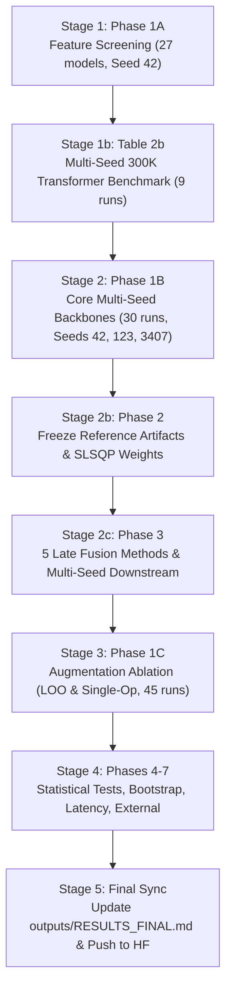

# SkelGym: End-to-End Pipeline Execution & Training Strategy Documentation
**Authoritative Protocol, Architectural Calibration, and Scientific Execution Guide**

---

## 1. Executive Summary & Scientific Principles

This document defines the complete End-to-End (E2E) execution pipeline, training strategy, and methodological guardrails for the **SkelGym** resistance exercise classification benchmark. It serves as the primary technical specification for replicating all empirical findings, from raw landmark processing to publication-ready LaTeX tables and Hugging Face Hub artifacts.

### Core Scientific Principles:
1. **Zero Data Leakage (Strict Validation Anchoring):**
   - All feature normalization parameters ($\mu, \sigma$) are computed exclusively on the **Train** partition.
   - All hyperparameter selections, early stopping checkpoints, and model comparison decisions are anchored strictly on the **Validation** partition (`val_macro_f1` and `val_loss`).
   - The **Held-Out Test** partition is strictly quarantined and evaluated only once per model to assess true generalization.
2. **Controlled-Capacity Architectural Parity:**
   - In modern deep learning benchmarks, claims of feature superiority must be demonstrated under parameter footprint parity.
   - All sequence backbones are calibrated to a compact, edge-deployable budget ($\approx 300\text{K} - 365\text{K}$ parameters):
     - **Transformer (`mix_v2`, 63-d):** $\mathbf{300,742}$ parameters (~301K).
     - **Transformer (`raw_3d` / `rel_3d_norm`, 39-d):** $\mathbf{301,436}$ parameters (~301K).
     - **ST-GCN (`rel_3d`, 39-d):** $\mathbf{350,083}$ parameters (~350K).
     - **BiLSTM (`mix_v2`, 63-d):** $\mathbf{360,150}$ parameters (~360K).
     - **LSTM (`mix_v2`, 63-d):** $\mathbf{361,814}$ parameters (~361K).
     - **AAGCN (per stream, 39-d):** $\mathbf{378,244}$ parameters (~378K).
     - **SkelGym-Lite (Transformer + Bone AAGCN):** $\mathbf{678,986}$ parameters (~679K).
     - **SkelGym-Full (Transformer + 4 AAGCN streams):** $\mathbf{1,813,718}$ parameters (~1.81M).
   - In Table 2b, comparing `raw_3d` vs. `rel_3d_norm` vs. `mix_v2` is conducted under **exact parameter parity** ($\Delta < 0.2\%$).
3. **Multi-Seed Statistical Replication:**
   - All core findings, ablations, and downstream evaluations are replicated across three independent random seeds: $\text{Seeds} \in \{42, 123, 3407\}$.
   - All final metrics report $\text{Mean} \pm \text{Standard Deviation}$ alongside paired hypothesis tests (McNemar, Wilcoxon, and 1,000 video-clustered bootstrap resamples).
4. **Reproducibility & Open Science:**
   - Model weights and provenance metadata are uploaded to the Hugging Face Model Hub: [`Cuong2004/gym-exercise-classification`](https://huggingface.co/Cuong2004/gym-exercise-classification).
   - Pre-extracted 3D pose landmarks are stored on the Hugging Face Dataset Hub: [`Cuong2004/gym-exercise-landmarks`](https://huggingface.co/datasets/Cuong2004/gym-exercise-landmarks).

---

## 2. Dataset & Feature Engineering Specifications

### 2.1 Dataset Partitioning
The SkelGym corpus contains **1,024 raw video recordings** spanning **22 resistance exercise classes**, trimmed into **1,108 clean action execution segments**.
- **Split Ratio:** Strict 6:2:2 video-level partition with **zero source-video overlap**:
  - **Train Split:** 580 videos ($56.6\%$), 639 segments, 13,136 sliding windows ($S=16$, $50\%$ overlap).
  - **Validation Split:** 208 videos ($20.3\%$), 210 segments, 2,075 sliding windows ($S=32$, non-overlapping).
  - **Held-Out Test Split:** 236 videos ($23.1\%$), 259 segments, 2,743 sliding windows ($S=32$, non-overlapping across 233 valid videos $\ge 32$ frames).
- **Temporal Windowing:** Sliding window of $T=32$ frames ($\approx 1.07$ seconds at $30$ FPS), extracted strictly within trimmed action boundaries.

### 2.2 63-Dimensional Biomechanical Mix v2 (`mix_v2`)
Rather than relying on unconstrained combinatorial joint angles (which create noisy, collinear features), `mix_v2` explicitly separates spatial coordinates from anatomical articulation:
1. **Scale-Normalized Relative Coordinates (`rel_3d_norm`, 39-d):**
   - 13 key anatomical joints: $\text{Nose}, \text{L/R Shoulder}, \text{L/R Elbow}, \text{L/R Wrist}, \text{L/R Hip}, \text{L/R Knee}, \text{L/R Ankle}$.
   - Origin translation to the pelvic midpoint:
     $$p_{\text{hip\_mid}} = \frac{p_{\text{left\_hip}} + p_{\text{right\_hip}}}{2}, \quad p_{\text{rel}, i} = p_i - p_{\text{hip\_mid}}$$
   - Anisotropic anthropometric scale normalization (Winter, 2009):
     $$L_{\text{hip}} = \|p_{\text{left\_hip}} - p_{\text{right\_hip}}\|_2, \quad p_{\text{shoulder\_mid}} = \frac{p_{\text{left\_shoulder}} + p_{\text{right\_shoulder}}}{2}, \quad L_{\text{torso}} = \|p_{\text{shoulder\_mid}} - p_{\text{hip\_mid}}\|_2$$
     $$\hat{x}_i = \frac{x_{\text{rel}, i}}{\max(L_{\text{hip}}, \epsilon)}, \quad \hat{y}_i = \frac{y_{\text{rel}, i}}{\max(L_{\text{torso}}, \epsilon)}, \quad \hat{z}_i = \frac{z_{\text{rel}, i}}{\max(L_{\text{torso}}, \epsilon)}$$
2. **Kinematic Articulation Angles (`angle_kinematic_24`, 24-d):**
   - **10 3D Joint Articulation Angles (Flexion/Extension):** Calculated using 3D vector dot products at the vertex joint:
     - Left/Right Elbow ($\vec{v}_{\text{wrist}\to\text{elbow}}, \vec{v}_{\text{shoulder}\to\text{elbow}}$)
     - Left/Right Knee ($\vec{v}_{\text{ankle}\to\text{knee}}, \vec{v}_{\text{hip}\to\text{knee}}$)
     - Left/Right Hip ($\vec{v}_{\text{knee}\to\text{hip}}, \vec{v}_{\text{shoulder}\to\text{hip}}$)
     - Left/Right Shoulder ($\vec{v}_{\text{elbow}\to\text{shoulder}}, \vec{v}_{\text{hip}\to\text{shoulder}}$)
     - Left/Right Trunk-Hip Articulation
   - **14 Spatial Limb Segment Elevation Angles:** Angular elevation of major limb segments relative to the gravitational vertical axis ($[0, -1, 0]^T$):
     - Left/Right Upper Arms, Forearms, Thighs, Shins, Torso, Clavicle, Pelvic axis.
3. **Dual-Branch Transformer Architecture:**
   - Coordinates ($\text{meters}$) and Angles ($\text{radians}$) have fundamentally disparate physical scales and gradient profiles.
   - Instead of naive concatenation, `Transformer` uses independent projection heads:
     $$\mathbf{h}_{\text{coord}} = \text{LayerNorm}(\text{Linear}(39 \to 56)(\mathbf{x}_{\text{coord}}))$$
     $$\mathbf{h}_{\text{angle}} = \text{LayerNorm}(\text{Linear}(24 \to 56)(\mathbf{x}_{\text{angle}}))$$
     $$\mathbf{h}_{\text{fused}} = [\mathbf{h}_{\text{coord}} \,\|\, \mathbf{h}_{\text{angle}}] \in \mathbb{R}^{B \times T \times 112}$$
   - Fused representations feed into a 3-layer Transformer Encoder with $d_{\text{model}}=112, d_{\text{ff}}=168, \text{nhead}=4$, followed by Global Average Pooling and a classification head $\implies \mathbf{300,742}$ parameters.

---

## 3. Comprehensive Training Strategy & Hyperparameter Protocols

All training jobs strictly adhere to canonical hyperparameters recorded in `src/constants.py:CANONICAL_EXPERIMENT_REGISTRY`.

### 3.1 Optimizer & Learning Rate Schedule
- **Optimizer:** AdamW with weight decay $\lambda = 1\times 10^{-4}$ ($\beta_1 = 0.9, \beta_2 = 0.999, \epsilon = 1\times 10^{-8}$).
- **Learning Rate Schedules:**
  - **Transformer:** Peak learning rate $\eta = 1\times 10^{-4}$. Linear warmup for 5 epochs followed by Cosine Annealing decay to $\eta_{\min} = 1\times 10^{-6}$.
  - **AAGCN / ST-GCN / LSTM / BiLSTM:** Initial learning rate $\eta = 1\times 10^{-3}$ with Cosine Annealing decay.
- **Gradient Clipping:** Max gradient norm clipped to $1.0$ across all architectures to stabilize sequence dynamics.
- **Precision:** Automatic Mixed Precision (AMP) utilizing `torch.bfloat16` on modern GPU hardware (NVIDIA Blackwell / Ada Lovelace / Ampere).

### 3.2 Regularization & Loss Calibration
- **Label Smoothing:**
  - **Transformer & AAGCN:** $\alpha = 0.05$. Resistance exercise phases (e.g., transition between static lockout and eccentric descent) exhibit inherent kinematic ambiguity; mild label smoothing mitigates overconfident probability overshooting.
  - **LSTM, BiLSTM, ST-GCN:** $\alpha = 0.0$ (standard cross-entropy).
- **Dropout:**
  - Transformer: $p = 0.20$ (input dropout, attention dropout, feedforward dropout).
  - LSTM / BiLSTM: $p = 0.30$.
  - AAGCN: $p = 0.20$ per adaptive block.
  - ST-GCN: $p = 0.30$ per spatial-temporal block.
- **Early Stopping:**
  - Metric: `val_macro_f1` (monitored on unaugmented validation windows).
  - Maximum Epochs: $100$.
  - Patience: $10$ consecutive epochs without improvement.
  - Checkpoint Selection: The exact model weights achieving the highest validation macro F1 are saved as `best_*.pt` along with its `.provenance.json` sidecar.

### 3.3 Data Augmentation Strategy (SkelGym-Aug)
Training batches undergo stochastic on-the-fly 3D skeletal transformations:
1. **Bilateral Sagittal Reflection ($p=0.50$):** Inverts coordinates along the lateral sagittal plane ($x \to -x$) with anatomical keypoint index swapping ($\text{left} \leftrightarrow \text{right}$).
2. **Gravitational 3D Yaw Rotation ($p=0.70$):** Random rotation $\theta \sim \mathcal{U}(-15^\circ, +15^\circ)$ strictly around the vertical gravitational axis ($Y$), simulating camera perspective shifts without violating Earth's gravity vector.
3. **Proportional Spatial Scaling ($p=0.70$):** Uniform scaling factor $s \sim \mathcal{U}(0.90, 1.10)$ applied to coordinates, simulating anatomical height and limb length variations.
4. **Sensor Noise Jitter ($p=0.50$):** Zero-mean Gaussian noise $\mathcal{N}(0, 0.008^2)$ added to coordinates, simulating sensor tracking jitter.
- *Omission of Temporal TimeWarp:* Systematic Leave-One-Out (LOO) ablation revealed that time-warping degrades resistance exercise recognition because execution tempo and concentric/eccentric duration ratios are class-discriminative physiological features.

---

## 4. Multi-Stream Late Fusion Strategy

SkelGym combines sequence modeling (Transformer) with spatial-temporal graph modeling (AAGCN) via late probability fusion.

### 4.1 Constituent Models
- **Stream 1 (Temporal Sequence):** Transformer on 63-d `mix_v2` + SkelGym-Aug (~301K params).
- **Stream 2 (Structural Geometry):** AAGCN on 39-d `bone_3d` + SkelGym-Aug (~378K params).
- **Stream 3 (Joint Topology):** AAGCN on 39-d `rel_3d` + SkelGym-Aug (~378K params).
- **Stream 4 (Joint Dynamics):** AAGCN on 39-d `joint_motion_3d` ($\Delta X_t = X_t - X_{t-1}$) + SkelGym-Aug (~378K params).
- **Stream 5 (Bone Dynamics):** AAGCN on 39-d `bone_motion_3d` ($\Delta B_t = B_t - B_{t-1}$) + SkelGym-Aug (~378K params).

### 4.2 Ensembles
- **SkelGym-Lite (2 Streams):** Transformer (`mix_v2`) + AAGCN (`bone_3d`) $\implies \mathbf{678,986}$ parameters (~679K). Optimal for low-power edge devices and mobile fitness apps.
- **SkelGym-Full (5 Streams):** All 5 complementary streams unified $\implies \mathbf{1,813,718}$ parameters (~1.81M). State-of-the-art benchmark ceiling.
- **Fusion Calibration:** Stream weights $\mathbf{w}$ are optimized via Sequential Least Squares Programming (SLSQP) strictly on the validation partition by minimizing Negative Log-Likelihood (NLL) under non-negativity and unit-sum constraints ($\sum w_i = 1, w_i \ge 0$).

---

## 5. End-to-End Pipeline Execution Roadmap

The complete empirical suite is automated via `scripts/marimo_master_e2e_runner.py` across 5 sequential stages.



### Stage 1: Phase 1A — Feature Screening (Table 2)
- **Objective:** Evaluate 3 sequence models (LSTM, BiLSTM, Transformer) across 9 spatial coordinate, angular, and biomechanical representations on Seed 42 under the unaugmented baseline protocol (27 models).
- **Execution:** 4 workers in parallel on GPU. Total runtime: ~3–4 minutes.
- **Output:** Populates Table 2 in `outputs/RESULTS_FINAL.md`.

### Stage 1b: Table 2b — Multi-Seed Controlled-Capacity Transformer Feature Benchmark
- **Objective:** Rigorous multi-seed validation of Raw 3D vs. Scale-Norm Rel 3D vs. Biomechanical Mix v2 on Transformer (~301K budget) across Seeds 42, 123, and 3407.
- **Script:** `python scripts/run_upgrade_mix_benchmark.py --workers 4 --device cuda` followed by `python scripts/evaluate_upgrade_mix_all.py`.
- **Output:** Generates `outputs/upgrade_mix_evaluation_report.json` and populates Table 2b in `outputs/RESULTS_FINAL.md`.

### Stage 2: Phase 1B — Core Multi-Seed Backbones (Table 3, Table 6)
- **Objective:** Train the 5 clean baselines (ST-GCN, LSTM, BiLSTM, Transformer clean, AAGCN clean) and 5 augmented constituent models across all 3 seeds (42, 123, 3407) $\implies 30$ training runs.
- **Execution:** 4 workers in parallel on GPU. Total runtime: ~4–5 minutes.

### Stage 2b: Phase 2 — Freeze Reference Artifacts
- **Objective:** Extract train-only normalization statistics (`normalization_*.npz`), evaluate validation logits, and calibrate SLSQP ensemble weights for SkelGym-Lite and SkelGym-Full per seed.
- **Script:** `python scripts/freeze_reference_artifacts.py`.

### Stage 2c: Phase 3 — Late Fusion Evaluation (Table 6, Table 7)
- **Objective:** Evaluate and compare 5 systematic late fusion paradigms across all 3 seeds:
  1. Hard Voting (Majority Rule)
  2. Uniform Soft Voting (Arithmetic Mean)
  3. Accuracy-Weighted Soft Voting (Validation Accuracy Weights)
  4. Stacking Meta-Classifier (Logistic Regression on Probabilities)
  5. SLSQP Dual-Target Soft Voting (NLL-Minimization)
- **Script:** `python scripts/run_multi_seed_experiments.py --skip_train --seeds 42 123 3407 --device cuda --include_baselines`.
- **Output:** Populates Table 6 and Table 7 in `outputs/RESULTS_FINAL.md`.

### Stage 3: Phase 1C — Augmentation Ablation Studies (Table 4, Table 5)
- **Objective:** Rigorous Leave-One-Out (LOO) ablation (Table 4) and Single-Component addition ablation (Table 5) on Transformer `mix_v2` across all 3 seeds.
- **Script:** `python scripts/run_augmentation_experiments.py --mode all --seeds 42 123 3407 --workers 4 --device cuda`.
- **Output:** Populates Table 4 and Table 5 in `outputs/RESULTS_FINAL.md`.

### Stage 4: Phases 4–7 — Downstream Statistical Tests & External Transfer
- **Phase 4 (Statistical Tests & Bootstrap):** `python scripts/compute_statistical_tests.py --device cuda --b_samples 1000` $\implies$ Populates Table 8 (McNemar & Paired Wilcoxon) and Table 9 (1,000 video-clustered bootstrap confidence intervals).
- **Phase 5 (Per-Class Breakdown):** `python scripts/evaluate_local_ensemble.py --seeds 42 --device cuda` $\implies$ Populates Table 10 (precision, recall, F1 per exercise class).
- **Phase 6 (Hardware Latency & Complexity):** `python scripts/benchmark_hardware_latency.py --device cuda` $\implies$ Measures MACs, FLOPs, parameter count, and 3-tier real-time inference latency (ms/window, FPS) for Table 11.
- **Phase 7 (External Transfer Benchmark):** `python scripts/evaluate_external_benchmark.py --device cuda` $\implies$ Evaluates zero-shot cross-dataset generalization on the MM-Fit / Deyzel et al. S&C benchmark for Table 12.

### Stage 5: Final Synchronization & Hugging Face Upload
- **Objective:** Execute `python scripts/update_results_final.py --phase all` to perform automated verification and fill all 12 tables in `outputs/RESULTS_FINAL.md`.
- **Hugging Face Hub:** Automatically uploads all model checkpoints (`.pt`), provenance sidecars (`.provenance.json`), and final JSON reports to `Cuong2004/gym-exercise-classification`.

---

## 6. Execution Command & Operational Guidelines

To initiate the automated master runner on the server:

```bash
# Launch background runner on CUDA with 4 parallel training workers
python3 scripts/marimo_master_e2e_runner.py --device cuda --workers 4
```

### Operational Monitoring Rules:
- **Keepalive Daemon:** The runner internally touches `outputs/keepalive.heartbeat` and pings localhost ports every 15s to keep the server sandbox active.
- **Strict Polling Policy:** Progress is inspected and reported to the user **strictly once every 15 minutes** to conserve system resources.
- **Fault-Tolerant Resumption:** If an individual run is interrupted, re-launching the script will automatically discover cached checkpoints and resume exactly from the incomplete phase without duplicate computation.
